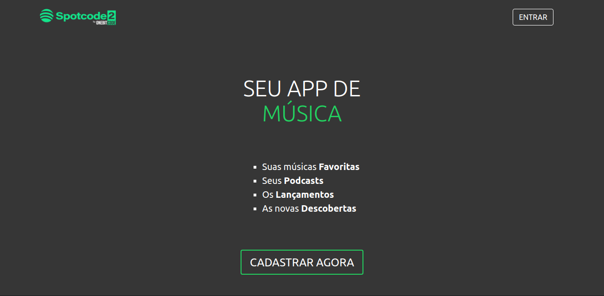
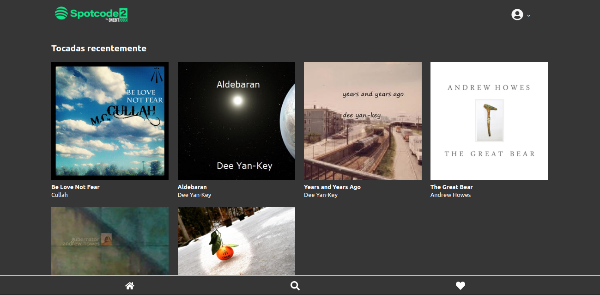
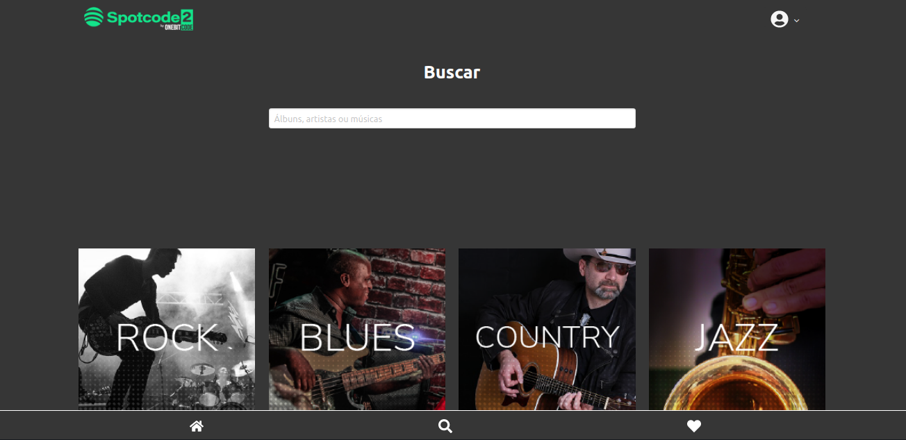

<h1 align="center">
  <strong>Spotcode</strong>
</h1> 

🎧 A Spotify clone made from a OneBitCode minicourse to improve knowledge in Rails and ReactJS. 🎼

 

## 🎨 Screens

<h3 align="center">
  
  
  
  
</h3>

## ✅ Features
- Search songs registered in the database
- Favorite music
- And what could not miss: playing music

## 🧰 Tools

- [ReactJS](https://pt-br.reactjs.org/)
- [Ruby 2.7](https://www.ruby-lang.org/en/news/2019/12/25/ruby-2-7-0-released/)
- [Rails 6.0.2.2](https://edgeguides.rubyonrails.org/6_0_release_notes.html/)
- [Devise (Gem)](https://github.com/heartcombo/devise)

## 👩‍🏫 Getting started

- Cloning
  - `git clone https://github.com/Hilderlan/spotcode.git`;
  - `cd spotcode`;
- Run
  - `rails db:create db:migrate db:seed`;
  - `rails s`;
 
## 🙋‍♂️ Author

* **Hilderlan Almeida** - [Hilderlan](https://github.com/Hilderlan)